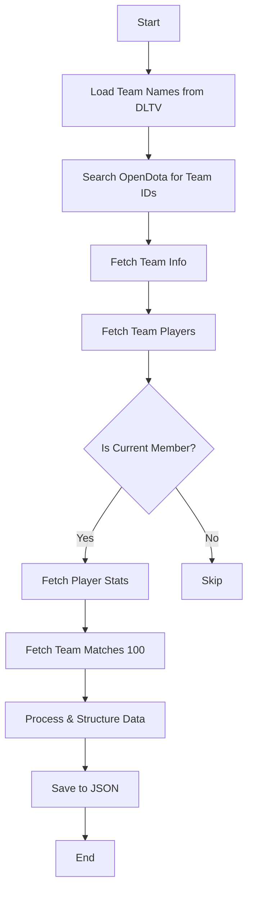

# PRD - DreamLeague Season 27 Data Collection System

## 📋 Documento de Requisitos do Produto (PRD)

**Versão:** 1.0  
**Data:** 2025-12-10  
**Autor:** Prometheus AI System  
**Status:** Em Desenvolvimento

---

## 1. Visão Geral

### 1.1 Objetivo
Desenvolver um sistema automatizado de coleta de dados para o torneio **DreamLeague Season 27** utilizando a API da OpenDota, estruturando uma base de dados completa com:
- Dados de 24 times participantes
- Últimas 100 partidas de cada time
- Roster atual de cada equipe
- Estatísticas individuais dos jogadores ativos

### 1.2 Escopo
| Item | Descrição |
|------|-----------|
| **Torneio** | DreamLeague Season 27 |
| **Período** | 9-20 de Dezembro de 2025 |
| **Prize Pool** | $1,000,000 USD |
| **Formato** | Swiss System (Group) + Double Elimination (Playoffs) |
| **Times** | 24 equipes |
| **Fonte de Dados** | OpenDota API + DLTV Calendar |

### 1.3 Stakeholders
- Sistema Prometheus (Análise de apostas)
- Usuário final (Apostador)

---

## 2. Informações do Torneio

### 2.1 Estrutura
```
Group Stage (Dec 10-16): Swiss System Bo3
├── Round 1: 12 matches
├── Round 2: 12 matches  
├── Round 3: 12 matches
├── Round 4: 8 matches (tiebreakers)
└── Round 5: 4 matches (final qualifiers)

Playoffs (Dec 17-20): Double Elimination
├── Upper Bracket: Bo3
├── Lower Bracket: Bo3
└── Grand Finals: Bo5
```

### 2.2 Times Participantes (24)

#### Tier 1 - Convidados (12)
| # | Time | Tag | Região | OpenDota ID |
|---|------|-----|--------|-------------|
| 1 | Team Falcons | FLCN | MENA | **TBD** |
| 2 | Xtreme Gaming | XG | China | 8599101 |
| 3 | Team Spirit | TS | CIS | 7119388 |
| 4 | Team Liquid | Liquid | EU | 2163 |
| 5 | Tundra Esports | Tundra | EU | 8291895 |
| 6 | BetBoom Team | BB | CIS | **TBD** |
| 7 | PARIVISION | PV | CIS | **TBD** |
| 8 | HEROIC | HEROIC | SA | **TBD** |
| 9 | Nigma Galaxy | NGX | MENA | 7554697 |
| 10 | OG | OG | SEA | 2586976 |
| 11 | Aurora Gaming | Aurora | CIS | **TBD** |
| 12 | Natus Vincere | NaVi | EU | 36 |

#### Tier 2 - Qualificados (12)
| # | Time | Tag | Região | OpenDota ID |
|---|------|-----|--------|-------------|
| 13 | Virtus.pro | VP | EU | 1883502 |
| 14 | MOUZ | MOUZ | EU | **TBD** |
| 15 | GamerLegion | GL | NA | **TBD** |
| 16 | Amaru Gaming | Amaru | SA | **TBD** |
| 17 | Runa Team | Runa | CIS | **TBD** |
| 18 | Yakult Brothers | YB | China | **TBD** |
| 19 | Team Nemesis | Nemesis | SEA | **TBD** |
| 20 | Team Yandex | Yandex | EU | **TBD** |
| 21 | 1win Team | 1win | CIS | **TBD** |
| 22 | Pipsqueak+4 | P+4 | EU | **TBD** |
| 23 | Passion UA | PUA | EU | **TBD** |
| 24 | Team Tidebound | Tide | EU | **TBD** |

### 2.3 Calendário - Dezembro 10, 2025 (Round 1)

| Match | Time (CET) | Time (BRT) | Team A | Team B |
|-------|------------|------------|--------|--------|
| 1 | 08:00 | 04:00 | Team Liquid | Team Nemesis |
| 2 | 08:00 | 04:00 | Team Spirit | 1win Team |
| 3 | 08:00 | 04:00 | OG | Team Tidebound |
| 4 | 11:00 | 07:00 | Team Falcons | Passion UA |
| 5 | 11:00 | 07:00 | Tundra Esports | Amaru Gaming |
| 6 | 11:00 | 07:00 | MOUZ | Pipsqueak+4 |
| 7 | 14:00 | 10:00 | BetBoom Team | Runa Team |
| 8 | 14:00 | 10:00 | PARIVISION | GamerLegion |
| 9 | 14:00 | 10:00 | Team Yandex | Virtus.pro |
| 10 | 17:00 | 13:00 | HEROIC | Yakult Brothers |
| 11 | 17:00 | 13:00 | Xtreme Gaming | Nigma Galaxy |
| 12 | 17:00 | 13:00 | Aurora Gaming | Natus Vincere |

---

## 3. Requisitos Técnicos

### 3.1 API OpenDota

#### Endpoints Necessários
```http
# Buscar Team ID
GET /search?q={team_name}

# Informações do Time
GET /teams/{team_id}

# Roster (jogadores)
GET /teams/{team_id}/players

# Últimas partidas do time
GET /teams/{team_id}/matches?limit=100

# Estatísticas do jogador
GET /players/{account_id}

# Heróis do jogador
GET /players/{account_id}/heroes

# Partidas recentes do jogador
GET /players/{account_id}/recentMatches
```

#### Rate Limiting
| Tipo | Limite | Notas |
|------|--------|-------|
| Sem API Key | 60 req/min | Gratuito |
| Com API Key | 3000 req/min | $0.0001/call |

**API Key disponível:** `00495232-b2b4-4d0b-87e3-c01de846c4b4`

### 3.2 Estrutura de Dados

#### `dreamleague_s27.json`
```json
{
  "$schema": "prometheus_league_v2",
  "version": "2.0.0",
  "last_updated": "2025-12-10T00:00:00Z",
  "tournament": {
    "id": "dreamleague_s27",
    "opendota_league_id": null,
    "name": "DreamLeague Season 27",
    "tier": 1,
    "prize_pool": 1000000,
    "currency": "USD",
    "start_date": "2025-12-09",
    "end_date": "2025-12-20",
    "location": "Stockholm, Sweden",
    "organizer": "DreamHack",
    "format": {
      "group_stage": {
        "type": "Swiss System",
        "format": "Bo3",
        "teams": 24,
        "rounds": 5,
        "advance": 8,
        "eliminate": 8
      },
      "playoffs": {
        "type": "Double Elimination",
        "format_upper": "Bo3",
        "format_lower": "Bo3",
        "format_finals": "Bo5",
        "teams": 8
      }
    }
  },
  "teams": [...],
  "schedule": {...},
  "head_to_head": {...}
}
```

#### `pro_teams.json`
```json
{
  "$schema": "prometheus_teams_v2",
  "version": "2.0.0",
  "last_updated": "2025-12-10T00:00:00Z",
  "teams": [
    {
      "team_id": 7119388,
      "name": "Team Spirit",
      "tag": "TS",
      "region": "CIS",
      "tier": "S",
      "opendota": {
        "rating": 1450.5,
        "wins": 285,
        "losses": 112,
        "last_match_time": 1733788800
      },
      "current_roster": [
        {
          "account_id": 321580662,
          "name": "Yatoro",
          "real_name": "Illya Mulyarchuk",
          "role": "carry",
          "position": 1,
          "country": "UA",
          "is_captain": false
        }
      ],
      "coach": {
        "name": "Silent",
        "account_id": null
      },
      "recent_stats": {
        "matches_30d": 45,
        "winrate_30d": 71.1,
        "avg_duration": 2150,
        "first_blood_rate": 58.2
      },
      "achievements": [
        {"event": "TI11", "placement": 1},
        {"event": "DreamLeague S26", "placement": 3}
      ]
    }
  ]
}
```

#### `pro_players.json`
```json
{
  "$schema": "prometheus_players_v2",
  "version": "2.0.0",
  "last_updated": "2025-12-10T00:00:00Z",
  "players": [
    {
      "account_id": 321580662,
      "name": "Yatoro",
      "real_name": "Illya Mulyarchuk",
      "team_id": 7119388,
      "team_name": "Team Spirit",
      "role": "carry",
      "position": 1,
      "country": "UA",
      "stats": {
        "total_matches": 1250,
        "winrate": 62.5,
        "avg_kills": 8.2,
        "avg_deaths": 4.1,
        "avg_assists": 9.5,
        "avg_gpm": 625,
        "avg_xpm": 710,
        "kda": 4.32
      },
      "signature_heroes": [
        {"hero_id": 1, "hero_name": "Anti-Mage", "matches": 85, "winrate": 68.2},
        {"hero_id": 81, "hero_name": "Chaos Knight", "matches": 72, "winrate": 70.8}
      ],
      "recent_form": {
        "matches_7d": 12,
        "winrate_7d": 75.0,
        "avg_kda_7d": 5.1
      }
    }
  ]
}
```

---

## 4. Arquitetura do Sistema

### 4.1 Componentes

```
scripts/
├── opendota_collector.py      # Coletor principal
├── team_resolver.py           # Resolve team_ids via search
├── roster_validator.py        # Valida roster atual vs histórico
└── data_processor.py          # Processa e estrutura dados

Database/Json/
├── leagues/
│   └── dreamleague_s27.json   # Dados do torneio
├── teams/
│   └── pro_teams.json         # Times Tier 1/2
├── players/
│   └── pro_players.json       # Jogadores profissionais
└── matches/
    └── dreamleague_s27/       # Partidas do torneio
        ├── team_spirit_100.json
        ├── team_liquid_100.json
        └── ...
```

### 4.2 Fluxo de Coleta



### 4.3 Rate Limit Strategy

```python
# Com API Key: 3000 req/min
# Estimativa de requests por time:
# - 1x team info
# - 1x team players
# - 1x team matches (100)
# - 5x player stats (avg roster)
# - 5x player heroes
# = ~13 requests/team

# Total: 24 teams × 13 = 312 requests
# Tempo estimado: ~10 segundos (com API key)
# Sem API key: ~6 minutos
```

---

## 5. Implementação

### 5.1 Fase 1 - Setup (Prioridade: Alta)
- [x] Criar estrutura de pastas
- [ ] Criar `dreamleague_s27.json` base
- [ ] Implementar `opendota_collector.py`
- [ ] Resolver todos os Team IDs

### 5.2 Fase 2 - Coleta (Prioridade: Alta)
- [ ] Coletar dados dos 24 times
- [ ] Validar rosters atuais
- [ ] Coletar 100 partidas por time
- [ ] Coletar stats dos jogadores

### 5.3 Fase 3 - Processamento (Prioridade: Média)
- [ ] Calcular estatísticas agregadas
- [ ] Identificar padrões de draft
- [ ] Gerar head-to-head data
- [ ] Calcular form recente

### 5.4 Fase 4 - Integração (Prioridade: Média)
- [ ] Atualizar `app.py` com novos dados
- [ ] Criar página DreamLeague S27
- [ ] Implementar predições
- [ ] Deploy no Streamlit Cloud

---

## 6. Riscos e Mitigações

| Risco | Probabilidade | Impacto | Mitigação |
|-------|--------------|---------|-----------|
| Team IDs não encontrados | Média | Alto | Busca manual + Liquipedia |
| Rate limit excedido | Baixa | Médio | Usar API key + delays |
| Dados desatualizados | Média | Médio | Refresh antes de cada partida |
| Roster mudou recentemente | Alta | Alto | Validar `is_current_team_member` |

---

## 7. Métricas de Sucesso

| Métrica | Target |
|---------|--------|
| Teams coletados | 24/24 (100%) |
| Players identificados | 120+ (5 por time) |
| Partidas por time | 100 (ou max disponível) |
| Tempo de coleta | < 10 min |
| Uptime do sistema | 99% durante torneio |

---

## 8. Timeline

```
Dec 10, 2025:
├── 00:00-02:00 - Implementar collector
├── 02:00-03:00 - Resolver Team IDs
├── 03:00-04:00 - Coletar todos os dados
├── 04:00-05:00 - Processar e validar
└── 05:00-06:00 - Deploy atualizado

Dec 10-20, 2025:
├── Refresh diário dos dados
├── Update após cada partida
└── Ajustes de predição
```

---

## 9. Próximos Passos

1. **Imediato:** Criar `opendota_collector.py`
2. **Imediato:** Buscar Team IDs faltantes
3. **Hoje:** Coletar dados de todos os 24 times
4. **Hoje:** Atualizar app com página DreamLeague S27
5. **Amanhã:** Validar predições com partidas reais

---

## Apêndice A - OpenDota API Reference

### Search Team
```bash
curl "https://api.opendota.com/api/search?q=Team%20Spirit"
```

### Get Team Info
```bash
curl "https://api.opendota.com/api/teams/7119388"
```

### Get Team Players
```bash
curl "https://api.opendota.com/api/teams/7119388/players"
```

### Get Team Matches
```bash
curl "https://api.opendota.com/api/teams/7119388/matches?limit=100"
```

### Get Player Stats
```bash
curl "https://api.opendota.com/api/players/321580662"
```

---

## Apêndice B - Known Team IDs

```json
{
  "Team Spirit": 7119388,
  "Team Liquid": 2163,
  "Tundra Esports": 8291895,
  "OG": 2586976,
  "Nigma Galaxy": 7554697,
  "Virtus.pro": 1883502,
  "Natus Vincere": 36,
  "Xtreme Gaming": 8599101
}
```

**IDs a descobrir:**
- Team Falcons
- BetBoom Team
- PARIVISION
- HEROIC
- Aurora Gaming
- MOUZ
- GamerLegion
- Amaru Gaming
- Runa Team
- Yakult Brothers
- Team Nemesis
- Team Yandex
- 1win Team
- Pipsqueak+4
- Passion UA
- Team Tidebound
